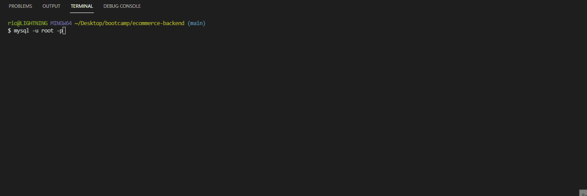
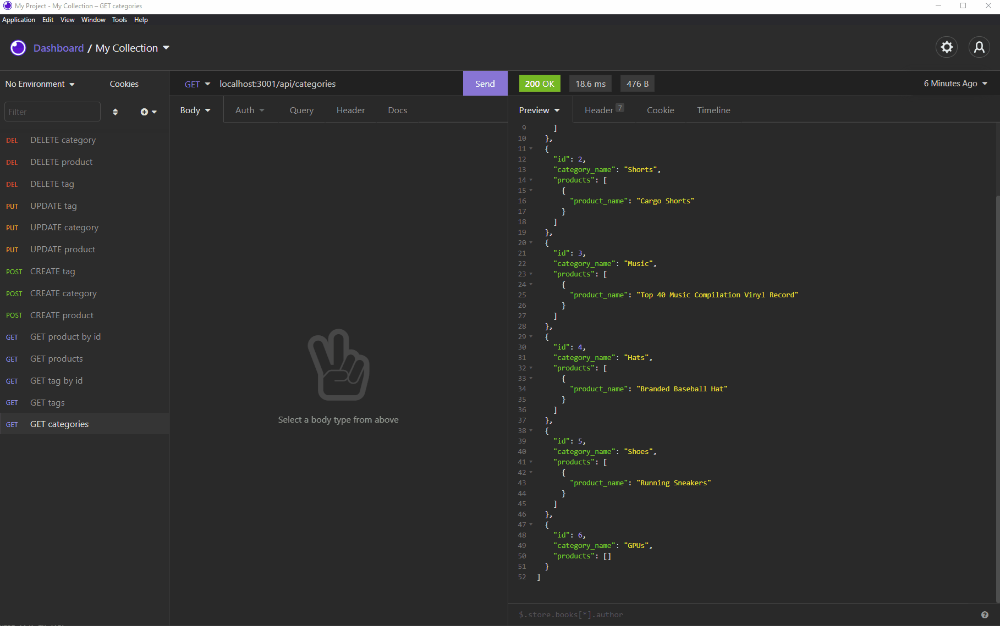

## Object-Relational Mapping (ORM): E-Commerce Back End

    
    
    
    
    
    
    

This is the backend for an E-Commerce website built using MySQL2, Express, Sequelize, and dotenv.

### Installation and Usage

1. Install necessary dependencies (`npm install; npm install mysql2; npm install express; npm install sequelize; npm install dotenv;`)
2. Enter the MySQL shell (`mysql -u root -p`) and sourcing the schema (`source db/schema.sql; quit`).
3. Seed the database by running `npm run seed` in the root directory.
4. Start the database by running `npm start`.

Database Seeding and Initialization

Routes Demonstration

### Questions
[https://github.com/rjcostanzo](https://github.com/rjcostanzo)